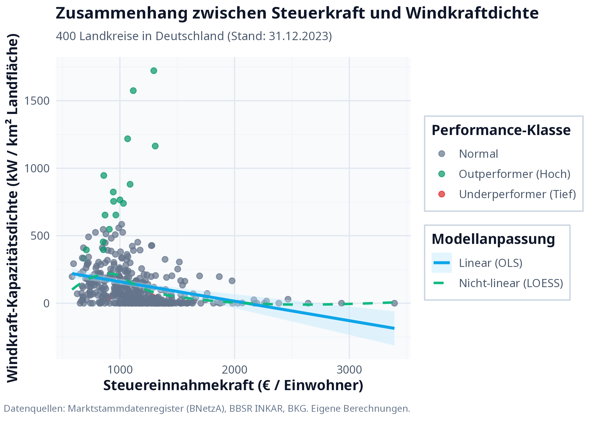
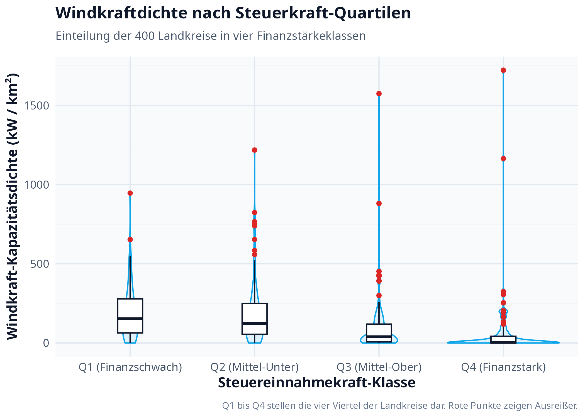

```{r setup, include=FALSE}
# fig.pos = "H" (zusammen mit \usepackage{float}) haelt jede Abbildung exakt
# an der Stelle im Text, an der sie im Rmd steht - sonst darf LaTeX Abbildungen
# als "schwebende" Elemente frei auf spaetere Seiten verschieben.
knitr::opts_chunk$set(echo = FALSE, warning = FALSE, message = FALSE,
                      fig.align = "center", fig.pos = "H")

library(sf)
library(tidyverse)
library(knitr)

# Gespeicherte Ergebnisse laden (siehe run_pipeline.sh) - kein Neuberechnen,
# damit dieses Dokument in Sekunden statt Minuten rendert.
daten_sf <- st_read("data/smart_planner_daten_mit_residuen.gpkg", quiet = TRUE)
df <- daten_sf %>% st_drop_geometry() %>% as_tibble()
load("data/modell_ergebnisse.RData")

# Zahlen im Fließtext deutsch formatieren (Komma statt Punkt als Dezimaltrennzeichen)
de_num <- function(x, digits = 2) {
  format(round(x, digits), nsmall = digits, decimal.mark = ",", big.mark = ".", trim = TRUE)
}
```

# Einleitung und Forschungsfrage

Windkraftanlagen an Land sind ein wichtiger Baustein der Energiewende,
verteilen sich aber sehr ungleich über Deutschland: manche Landkreise
sind voller Windräder, andere haben fast keine. Dieser Bericht geht der
Frage nach, ob dabei auch eine Rolle spielt, wie gut ein Kreis finanziell
dasteht:

> **Hängt der Ausbau von Windkraft an Land damit zusammen, wie
> finanzstark ein Landkreis ist?**

Zwei Vermutungen sind denkbar. Erstens: finanzschwache Kreise bauen
gezielt mehr Windkraft aus, weil sie über Pacht- und Gewerbesteuer
zusätzliches Geld einnehmen können. Zweitens: das Gegenteil ist ebenso denkbar. Windräder kosten die
Gemeinde selbst nichts, also könnten arme wie reiche
Kreise gleichermaßen profitieren, oder wohlhabende Kreise bremsen den
Ausbau eher aus (Widerstand vor Ort, "nicht in meiner Nachbarschaft").
Untersucht werden alle 400 deutschen Landkreise und kreisfreien Städte, mit
einem Datenstand von 2023/2024, also einer Momentaufnahme ohne
Verlauf über die Zeit.

# Daten und Methodik

Um die Frage zu beantworten, braucht es für jeden der 400 Kreise Zahlen zu
vier Dingen: wie viel Windkraft dort bereits installiert ist, wie
finanzstark der Kreis ist, wie windig es dort überhaupt ist, und ein paar
weitere Eigenschaften des Kreises (Bevölkerungsdichte, Flächennutzung,
Wirtschaftsstruktur), die den Windkraftausbau ebenfalls beeinflussen
könnten und deshalb mit betrachtet werden müssen, denn sonst würde man
ihren Effekt fälschlich der Finanzkraft zuschreiben. Diese Zahlen stammen aus
vier öffentlichen Quellen und wurden über den Amtlichen Gemeindeschlüssel
(eine Art Postleitzahl für Verwaltungszwecke) zusammengeführt: dem
Marktstammdatenregister (installierte Windleistung je Kreis), der
INKAR-Datenbank des Bundesinstituts für Bau-, Stadt- und Raumforschung
(Finanzkraft und weitere Kreis-Eigenschaften), den amtlichen
Verwaltungsgrenzen des Bundesamts für Kartographie und Geodäsie
(Kreisgrenzen, Fläche, Einwohnerzahl) und dem Global Wind Atlas (mittlere
Windgeschwindigkeit als Maß dafür, wie viel Wind ein Kreis überhaupt zu
bieten hat). Die folgende Tabelle zeigt alle verwendeten Größen im
Überblick; woher genau jede einzelne INKAR-Zahl stammt, steht in
`docs/00_datenquellen.md`.

```{r tab-variablen}
variablen_tab <- tribble(
  ~Rolle, ~Variable, ~Einheit, ~Quelle,
  "Y (Ziel)", "Windkraft-Kapazitätsdichte", "kW/km²", "MaStR (BNetzA)",
  "X (Haupt)", "Steuereinnahmekraft je Einwohner", "€/Ew.", "INKAR (Kennziffer 294)",
  "Kontrolle", "Ø Windgeschwindigkeit (150 m)", "m/s", "Global Wind Atlas",
  "Kontrolle", "Einwohnerdichte", "Ew./km²", "INKAR (320)",
  "Kontrolle", "Waldflächenanteil", "%", "INKAR (264)",
  "Kontrolle", "Landwirtschaftsanteil", "%", "INKAR (261)",
  "Kontrolle", "Beschäftigte nach Sektor", "%", "INKAR (103, 104, 105)"
)
kable(variablen_tab, caption = "Verwendete Variablen im Überblick", format = "latex", booktabs = TRUE)
```

Wie viel Windkraft ein Kreis ausgebaut hat, messen wir nicht in
Megawatt absolut (ein großer Kreis hat sonst automatisch mehr Anlagen als
ein kleiner), sondern je Quadratkilometer Fläche. So werden Kreise
unterschiedlicher Größe vergleichbar:
$$\text{Windkraftdichte} = \frac{\text{Installierte Leistung in kW}}{\text{Fläche des Kreises in km}^2}$$

Bei dieser Kennzahl gibt es sehr viele Kreise mit wenig Windkraft und
wenige Kreise mit extrem viel: die Hälfte aller Kreise liegt bei nur rund
`r round(median(df$Wind_Density_kW_km2) / max(df$Wind_Density_kW_km2) * 100, 0)`
% des höchsten vorkommenden Werts. Würde man das ganz normal auf einer
Achse von 0 bis zum Maximum abtragen, würden fast alle Kreise als ein
einziger Klumpen nahe der Null erscheinen und kaum Unterschiede zeigen.
Die Grafiken in Abschnitt 3 stauchen die Achse deshalb so, dass sich auch
die kleinen Werte noch unterscheiden lassen (jeder Abschnitt auf der Achse
entspricht einer Verzehnfachung statt eines festen Betrags). **Das ändert
nur die Darstellung: Gerechnet wird im Modell weiterhin mit den echten,
unveränderten Zahlen.**

Zusätzlich ordnen wir jeden Kreis grob einem wirtschaftlichen Typ zu, je
nachdem in welchem Sektor die meisten Menschen arbeiten: "Industriell"
(mindestens 35 % arbeiten in der Industrie), "Ländlich/Agrarisch"
(mindestens 3 % arbeiten in der Landwirtschaft, das ist im deutschen
Vergleich schon viel), "Dienstleistungsorientiert" (mindestens 65 % im
Dienstleistungssektor), sonst "Ausgeglichen".

Die vier Quellen werden über den AGS zusammengeführt und daraus die
Zielgröße (Windkraftdichte) berechnet. Im Kern sieht das im Code so aus:

```{r code-datenaufbereitung, echo=TRUE, eval=FALSE}
library(sf)
library(tidyverse)

# Die vier Datenquellen einlesen (AGS als Text, damit führende Nullen bleiben)
geodaten   <- st_read("data/kreise_geodaten.gpkg")
windkraft  <- read_csv("data/wind_turbinen_je_kreis.csv",
                       col_types = cols(AGS = col_character()))
windgeschw <- read_csv("data/windgeschwindigkeit_je_kreis.csv",
                       col_types = cols(AGS = col_character()))
inkar      <- read_csv("data/inkar_kennzahlen_je_kreis.csv",
                       col_types = cols(AGS = col_character()))

# Über den Amtlichen Gemeindeschlüssel (AGS) zusammenführen
daten <- geodaten %>%
  left_join(windkraft, by = "AGS") %>%
  left_join(windgeschw, by = "AGS") %>%
  left_join(inkar, by = "AGS")

# Kreise ohne Windkraft-Eintrag haben keine Anlagen -> 0 statt NA,
# danach die Zielvariable je km² Fläche berechnen
daten <- daten %>%
  mutate(
    Total_Nettoleistung_kW = ifelse(is.na(Total_Nettoleistung_kW), 0,
                                    Total_Nettoleistung_kW),
    Wind_Density_kW_km2 = Total_Nettoleistung_kW / KFL_km2
  )
```

# Deskriptive Analyse

## Der scheinbare Zusammenhang

```{r plot1, out.width="85%", fig.cap="Steuerkraft vs. Windkraftdichte, alle 400 Kreise (y-Achse log-skaliert)."}

```

Jeder Punkt ist ein Landkreis. Die blaue Linie fasst den Trend zusammen
und zeigt nach unten: Kreise mit höherer Steuerkraft haben tendenziell
**weniger** Windkraft installiert, nicht mehr. Das ist zunächst nur eine
Beobachtung an den Rohdaten, ohne dass wir etwas herausgerechnet hätten.
Um zu prüfen, ob dieses Muster stabil ist, teilen wir alle Kreise in vier
gleich große Gruppen nach ihrer Steuerkraft ein (von finanzschwach bis
finanzstark) und vergleichen die Windkraftdichte in jeder Gruppe:

```{r plot2, out.width="85%", fig.cap="Windkraftdichte nach Steuerkraft-Quartilen."}

```

## Wirtschaftsstruktur und Kontrollvariablen

```{r plot3, out.width="70%", fig.cap="Windkraftdichte nach dominanter Wirtschaftsstruktur."}
include_graphics("plots/03_wirtschaftsstruktur.png")
```

Ländlich/agrarisch geprägte Kreise bauen im Schnitt am meisten Windkraft
aus. Das leuchtet ein, denn dort gibt es die nötigen freien Flächen.
Die folgende Abbildung zeigt, wie die Windkraftdichte jeweils für sich mit
Windgeschwindigkeit, Einwohnerdichte, Waldanteil und Landwirtschaftsanteil
zusammenhängt (jede Grafik betrachtet dabei nur eine einzige Variable,
ohne die anderen mit einzubeziehen):

```{r plot4, out.width="95%", fig.cap="Einfluss von Windgeschwindigkeit, Einwohnerdichte, Wald- und Landwirtschaftsanteil."}
include_graphics("plots/04_kontrollvariablen.png")
```

Am deutlichsten zeigt sich ein Zusammenhang bei der Windgeschwindigkeit:
mehr Wind, mehr installierte Leistung. Das ist ein erster Hinweis darauf,
dass der scheinbare Steuerkraft-Effekt aus dem vorigen Abschnitt eigentlich
etwas anderes widerspiegelt: vielleicht sind es einfach die windigen
Kreise, die zufällig auch finanzschwach sind, nicht die Finanzkraft
selbst.

# Multivariates Modell

Die bisherigen Grafiken zeigen immer nur zwei Größen auf einmal. Um
herauszufinden, ob die Steuerkraft **für sich genommen** noch etwas
erklärt, wenn man alle anderen Einflüsse (Windgeschwindigkeit,
Bevölkerungsdichte, Flächennutzung, Wirtschaftsstruktur) gleichzeitig
berücksichtigt, rechnen wir ein Modell, das alle diese Größen auf einmal
einbezieht (eine sogenannte multiple lineare Regression). Vereinfacht
gesagt: das Modell sucht für jede Einflussgröße einen eigenen Faktor, der
beschreibt, wie stark sie zur Windkraftdichte beiträgt, und zwar so, dass
alle anderen Einflüsse dabei konstant gehalten werden. So lässt sich der
Effekt der Steuerkraft von den übrigen Effekten trennen:

$$
\begin{aligned}
Y_i = \beta_0 &+ \beta_1\,\text{Steuerkraft}_i + \beta_2\,\text{Einwohnerdichte}_i + \beta_3\,\text{Windgeschwindigkeit}_i \\
&+ \beta_4\,\text{Wald}_i + \beta_5\,\text{Landwirtschaft}_i + \beta_6\,\text{Industrie}_i + \beta_7\,\text{Agrarbesch.}_i + \epsilon_i
\end{aligned}
$$

Das sieht komplizierter aus, als es ist: $Y_i$ ist die Windkraftdichte von
Kreis $i$, und jedes $\beta$ ist genau der gesuchte Faktor für eine
Einflussgröße: Zum Beispiel sagt $\beta_1$, wie viel sich die
Windkraftdichte im Schnitt ändert, wenn die Steuerkraft um eine Einheit
steigt und alles andere gleich bleibt. $\epsilon_i$ steht für den Teil, den
das Modell nicht erklären kann (Zufall oder fehlende Einflussgrößen).

Zwei Begriffe tauchen ab jetzt öfter auf: Weil die Einflussgrößen in ganz
unterschiedlichen Einheiten gemessen werden (Euro, Einwohner pro km²,
Prozent …), rechnen wir sie zusätzlich in eine gemeinsame,
**standardisierte** Skala um. So lässt sich direkt vergleichen, welche
Einflussgröße stärker wirkt, unabhängig von ihrer Einheit. Und der
**p-Wert** einer Einflussgröße sagt aus, wie wahrscheinlich es wäre, den
gefundenen Zusammenhang auch dann zu beobachten, wenn in Wirklichkeit gar
kein Zusammenhang besteht: Je kleiner der p-Wert, desto glaubwürdiger der
Effekt. Ab einem p-Wert unter 0,05 spricht man von einem
"signifikanten" (statistisch belastbaren) Effekt.

Im Code entsteht dieses Modell mit der Funktion `lm()`. Zusätzlich schätzen
wir eine standardisierte Variante, in der jede Größe mit `scale()` in
Standardabweichungen umgerechnet wird, damit die Effektstärken vergleichbar
werden:

```{r code-modell, echo=TRUE, eval=FALSE}
# Modellgleichung: Windkraftdichte erklärt durch Steuerkraft + Kontrollvariablen.
# Beschaeftigte_Tertiar wird weggelassen (die drei Sektoranteile ergeben 100 %).
modell_formel <- Wind_Density_kW_km2 ~ Steuerkraft + Einwohnerdichte +
  Windgeschwindigkeit_ms + Waldflaeche_Prozent + Landwirtschaft_Prozent +
  Beschaeftigte_Sekundar + Beschaeftigte_Primar

# Modell mit den Rohwerten schätzen
modell_roh <- lm(modell_formel, data = df)
summary(modell_roh)

# Standardisierte Version: jede Variable mit scale() umrechnen
df_z <- df %>%
  mutate(
    Wind_Density_kW_km2    = as.numeric(scale(Wind_Density_kW_km2)),
    Steuerkraft            = as.numeric(scale(Steuerkraft)),
    Einwohnerdichte        = as.numeric(scale(Einwohnerdichte)),
    Windgeschwindigkeit_ms = as.numeric(scale(Windgeschwindigkeit_ms)),
    Waldflaeche_Prozent    = as.numeric(scale(Waldflaeche_Prozent)),
    Landwirtschaft_Prozent = as.numeric(scale(Landwirtschaft_Prozent)),
    Beschaeftigte_Sekundar = as.numeric(scale(Beschaeftigte_Sekundar)),
    Beschaeftigte_Primar   = as.numeric(scale(Beschaeftigte_Primar))
  )

modell_std <- lm(modell_formel, data = df_z)
summary(modell_std)
```

```{r tab-modell}
klarnamen <- c(
  Steuerkraft = "Steuereinnahmekraft",
  Einwohnerdichte = "Einwohnerdichte",
  Windgeschwindigkeit_ms = "Ø Windgeschwindigkeit",
  Waldflaeche_Prozent = "Flächenanteil Wald",
  Landwirtschaft_Prozent = "Flächenanteil Landwirtschaft",
  Beschaeftigte_Sekundar = "Anteil Beschäftigte Industrie",
  Beschaeftigte_Primar = "Anteil Beschäftigte Landwirtschaft"
)

koeff_roh <- summary(modell_roh)$coefficients
koeff_std <- summary(modell_std)$coefficients
vars <- names(klarnamen)

modell_tab <- tibble(
  Variable = klarnamen[vars],
  VIF = round(vif_werte[vars], 2),
  `Koeff. (roh)` = round(koeff_roh[vars, "Estimate"], 3),
  `Koeff. (std.)` = round(koeff_std[vars, "Estimate"], 3),
  `p-Wert` = ifelse(koeff_roh[vars, "Pr(>|t|)"] < 0.001, "< 0.001",
                    sprintf("%.3f", koeff_roh[vars, "Pr(>|t|)"]))
)
kable(modell_tab, caption = "Regressionsergebnisse: roher und standardisierter Koeffizient je Einflussgröße, VIF-Prüfwert und p-Wert", format = "latex", booktabs = TRUE)
```

Die Spalte "VIF" prüft dabei nur, ob sich zwei Einflussgrößen zu stark
ähneln, um sie sauber auseinanderzuhalten (Faustregel: unter 10 ist das
kein Problem. Hier liegen alle Werte deutlich darunter, das Modell ist
also technisch in Ordnung).

Das eigentliche Ergebnis: Mit großem Abstand am wichtigsten ist die
**Windgeschwindigkeit** (standardisierter Effekt
+`r de_num(koeff_std["Windgeschwindigkeit_ms","Estimate"],3)`,
p `r ifelse(koeff_std["Windgeschwindigkeit_ms","Pr(>|t|)"]<0.001,"< 0,001", "")`).
Danach folgen Einwohnerdichte und Waldanteil, beide mit negativem
Vorzeichen, das heißt: je dichter besiedelt bzw. je waldreicher ein Kreis,
desto weniger Windkraft (nachvollziehbar, da dort weniger Platz für
Windräder ist). Die **Steuerkraft** dagegen liegt bei nur
+`r de_num(koeff_std["Steuerkraft","Estimate"],3)`
(p = `r de_num(koeff_std["Steuerkraft","Pr(>|t|)"],2)`). Ein p-Wert von
`r de_num(koeff_std["Steuerkraft","Pr(>|t|)"],2)` ist weit über der
Schwelle von 0,05, der Effekt ist also **nicht belastbar**, praktisch
nicht von null zu unterscheiden.

```{r plot7, out.width="80%", fig.cap="Effektstärke jeder Einflussgröße (standardisiert) mit 95%-Unsicherheitsbereich."}
include_graphics("plots/07_koeffizientenplot.png")
```

**Das zentrale Ergebnis dieses Berichts:** Der negative Zusammenhang aus
Abschnitt 3.1 (mehr Steuerkraft, weniger Windkraft) ist ein
**Scheinzusammenhang**. Er kommt dadurch zustande, dass finanzschwache,
ländliche Kreise im norddeutschen Tiefland zufällig auch die windreichsten
sind, nicht weil ihre Finanzlage den Ausbau antreibt. Berücksichtigt man
das Windpotenzial und die übrigen Einflussgrößen gleichzeitig, bleibt von
einem eigenständigen Effekt der kommunalen Finanzkraft nichts mehr übrig.

## Wie gut passt das Modell?

Für jeden Kreis lässt sich mit der Formel aus Tabelle 2 ein
**vorhergesagter Wert** berechnen: Man setzt die echten Kennzahlen des
Kreises (Windgeschwindigkeit, Einwohnerdichte usw.) ein und erhält, wie
viel Windkraftdichte dort laut dem allgemeinen Muster aller 400 Kreise zu
erwarten wäre. Das ist keine Zukunftsprognose, sondern der Erwartungswert
des Modells für diesen einen Kreis. Die Differenz zwischen dem
tatsächlichen und dem vorhergesagten Wert heißt **Residuum**: ein
positives Residuum bedeutet, ein Kreis baut mehr aus als erwartet, ein
negatives, er baut weniger aus.

Zwei zusätzliche Prüfungen dieser Residuen zeigen, wo die Grenzen des
Modells liegen. Die erste (Breusch-Pagan-Test) prüft, ob das Modell für manche Kreise
zuverlässiger ist als für andere. Das ist hier der Fall
(p < 0,001): Bei Kreisen mit sehr hohem vorhergesagtem Ausbau streuen die
Fehler des Modells stärker als bei Kreisen mit wenig Ausbau. Die zweite
Prüfung (Moran's I) checkt, ob benachbarte Kreise auch bei den Punkten
ähnlich abschneiden, die das Modell nicht erklären kann. Auch das trifft
zu (Wert `r de_num(moran_test$estimate[1],3)` auf einer Skala von -1 bis
+1, p < 0,001). Benachbarte Kreise ähneln sich also auch dort, wo unser
Modell an seine Grenzen stößt. Das spricht dafür, dass noch weitere,
hier nicht gemessene Faktoren eine Rolle spielen, die sich regional
häufen, zum Beispiel Landesplanungsrecht oder lokale Zustimmung zu
Windkraftprojekten, die von Bundesland zu Bundesland unterschiedlich
ausfallen.

# Ist das Ergebnis stabil? (Robustheitschecks)

Eine berechtigte Frage: Verschwindet der Steuerkraft-Effekt vielleicht
nur, weil wir sehr unterschiedliche Kreise in einen Topf werfen: windige
und windarme, ländliche und städtische? Um das zu prüfen, haben wir das
gleiche Modell **zusätzlich** (nicht anstelle des Hauptmodells) noch
zweimal gerechnet, jeweils nur mit einer engeren Auswahl an Kreisen: einmal
nur mit Kreisen, die überdurchschnittlich viel Wind haben, und einmal nur
mit den fünf norddeutschen Bundesländern.

```{r tab-robust}
kable(robustheit_tabelle %>%
        mutate(across(where(is.numeric), ~round(., 3))) %>%
        rename(Stichprobe = Stichprobe, `Koeffizient` = Steuerkraft_Koeffizient,
               `95%-KI unten` = Steuerkraft_Lower, `95%-KI oben` = Steuerkraft_Upper,
               `p-Wert` = Steuerkraft_p_Wert),
      caption = "Steuerkraft-Effekt: einmal mit allen Kreisen, zweimal mit einer engeren Auswahl",
      format = "latex", booktabs = TRUE)
```

```{r plot8, out.width="85%", fig.cap="Steuerkraft-Effekt (Punkt) mit Unsicherheitsbereich (Balken) in allen drei Varianten."}
include_graphics("plots/08_robustheitscheck.png")
```

Das Ergebnis ändert sich nicht: In allen drei Varianten bleibt der
Steuerkraft-Effekt klein, und der Unsicherheitsbereich reicht jedes Mal
weit in den negativen wie den positiven Bereich. Der Effekt ist also nie
sicher von null zu unterscheiden. Zwei weitere Kontrollen, die wir nicht
extra als Tabelle zeigen, bestätigen das: Erstens wirkt die Steuerkraft
auch nicht in windigen Kreisen anders als in weniger windigen (kein
Wechselspiel zwischen beiden Größen erkennbar, p = 0,357). Zweitens ändert
sich am Ergebnis auch nichts Wesentliches, wenn man die Windkraft pro
Einwohner statt pro Fläche misst: diese Variante macht die Verteilung nur
noch schiefer, ohne den Zusammenhang zur Steuerkraft zu verändern.

# Welche Kreise weichen am stärksten ab?

Nicht jeder Kreis folgt dem Modell gleich gut. Manche bauen deutlich mehr
Windkraft aus, als ihre Rahmenbedingungen erwarten lassen ("Outperformer"),
andere deutlich weniger ("Underperformer"). Diese Abweichungen zeigen, wo
noch andere, hier nicht erfasste Gründe eine Rolle spielen dürften.

```{r plot5, out.width="85%", fig.cap="Die 10 stärksten Outperformer und Underperformer nach Residuum."}
include_graphics("plots/05_residuen_ausreisser.png")
```

```{r outlier-liste, results="asis"}
top3 <- df %>% arrange(desc(Residuals)) %>% slice_head(n = 3) %>% pull(GEN)
bottom3 <- df %>% arrange(Residuals) %>% slice_head(n = 3) %>% pull(GEN)
cat("Die stärksten Outperformer sind", paste(top3, collapse = ", "),
    ". Sie bauen deutlich mehr Windkraft aus, als ihre Kennzahlen erwarten",
    "lassen, was auf lokale politische Steuerung oder besonders schnelle",
    "Planungsverfahren hindeutet. Am anderen Ende stehen", paste(bottom3, collapse = ", "),
    "als stärkste Underperformer.\n")
```

Zum Schluss noch zwei Kontrollgrafiken, die zeigen, wo das Modell an seine
Grenzen stößt:

```{r plot6, out.width="48%", fig.show="hold", fig.cap="Links: Fehler des Modells im Verhältnis zum vorhergesagten Wert. Rechts: wie gut die Fehler einer Normalverteilung folgen."}
include_graphics(c("plots/06a_residuen_fitted.png", "plots/06b_qq_plot.png"))
```

Im linken Bild streuen die Fehler bei hohen vorhergesagten Werten sichtbar
mehr. Das ist genau die bereits erwähnte ungleichmäßige Fehlerstreuung.
Im rechten Bild liegen die Punkte in der Mitte gut auf der Linie, weichen
an den Rändern aber ab: einige wenige Kreise mit extrem hohem Windkraftausbau
werden vom Modell unterschätzt.

# Fazit

Auf den ersten Blick sieht es so aus, als würden finanzschwache Kreise mehr
Windkraft ausbauen als finanzstarke. Dieser Eindruck hält aber einer
genaueren Prüfung nicht stand: Er entsteht nur, weil die windreichsten
Kreise Deutschlands (im norddeutschen Tiefland) zufällig auch eher
finanzschwach sind. Berücksichtigt man das Windpotenzial und weitere
Eigenschaften der Kreise gleichzeitig, bleibt von einem eigenen Effekt der
Finanzkraft praktisch nichts übrig (p = 0,73). Dieses Ergebnis bleibt
gleich, egal wie wir es geprüft haben: mit engerer Kreisauswahl, mit einem
anderen Modellaufbau, mit einer anderen Art die Windkraft zu messen.

Kurz gesagt: Ob ein Kreis viel Windkraft ausbaut, hängt in erster Linie
davon ab, wie viel Wind er hat und wie viel freie Fläche zur Verfügung
steht, nicht davon, wie gut es um seine Kassenlage steht. Dass
benachbarte Kreise trotzdem ähnlich stark vom Modell abweichen (räumliche
Häufung der Abweichungen,
Moran's I = `r de_num(moran_test$estimate[1],2)`), deutet aber darauf hin,
dass noch etwas anderes mitspielt, das wir hier nicht gemessen haben,
zum Beispiel Unterschiede in der Landespolitik oder in der Zustimmung vor
Ort zu neuen Windkraftprojekten.
